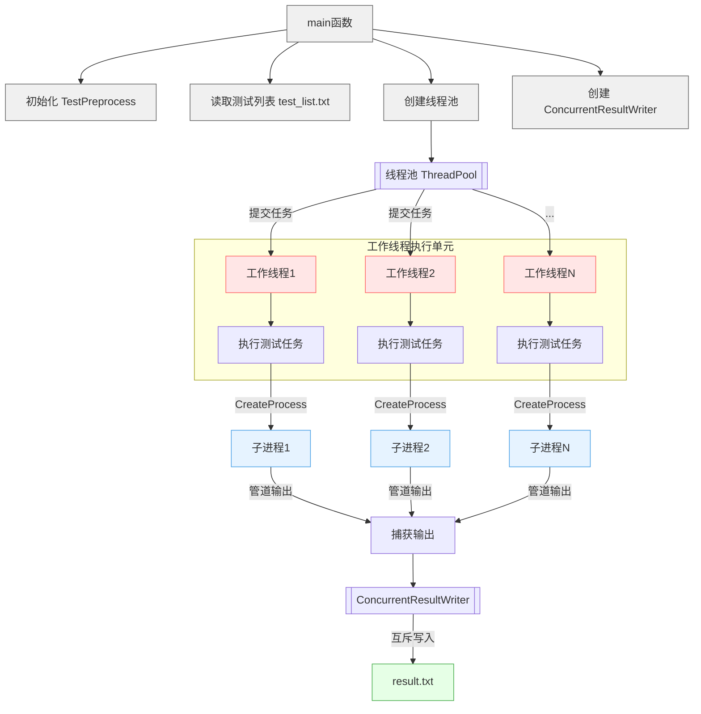

# 原生耗时

- **耦合版本：**142.469s 

- **独立版本：**1888.452s

# Python版本测试脚本耗时

- 耦合版本：579.437s
- 独立版本：707.479s

# C++版本耗时 V1

- 耦合版本：
- 独立版本：

```mermaid
graph TD
    %% Main 函数入口
    Main[main函数] --> Init[初始化 TestPreprocess]
    Main --> ReadList[读取测试列表 test_list.txt]
    Main --> CreatePool[创建线程池]
    Main --> CreateWriter[创建 ConcurrentResultWriter]

    %% 线程池调度
    CreatePool --> Pool[[线程池 ThreadPool]]
    Pool -->|提交任务| Worker1[工作线程1]
    Pool -->|提交任务| Worker2[工作线程2]
    Pool -->|...| WorkerN[工作线程N]

    %% 单个工作线程的任务流程
    subgraph 工作线程执行单元
        Worker1 --> Task1[执行测试任务]
        Worker2 --> Task2[执行测试任务]
        WorkerN --> TaskN[执行测试任务]
    end

    %% 子进程调用
    Task1 -->|CreateProcess| Process1[子进程1]
    Task2 -->|CreateProcess| Process2[子进程2]
    TaskN -->|CreateProcess| ProcessN[子进程N]

    %% 输出重定向
    Process1 -->|管道输出| Result[捕获输出]
    Process2 -->|管道输出| Result
    ProcessN -->|管道输出| Result

    %% 结果写入
    Result --> Writer[[ConcurrentResultWriter]]
    Writer -->|互斥写入| ResultFile[result.txt]

    %% 样式定义
    classDef process fill:#e6f3ff,stroke:#4ca1e6;
    classDef thread fill:#ffe6e6,stroke:#ff6666;
    classDef component fill:#f0f0f0,stroke:#666;
    classDef data fill:#e6ffe6,stroke:#4caf50;
    
    class Main,Init,ReadList,CreatePool,CreateWriter component;
    class Worker1,Worker2,WorkerN thread;
    class Process1,Process2,ProcessN process;
    class ResultFile data;
```

