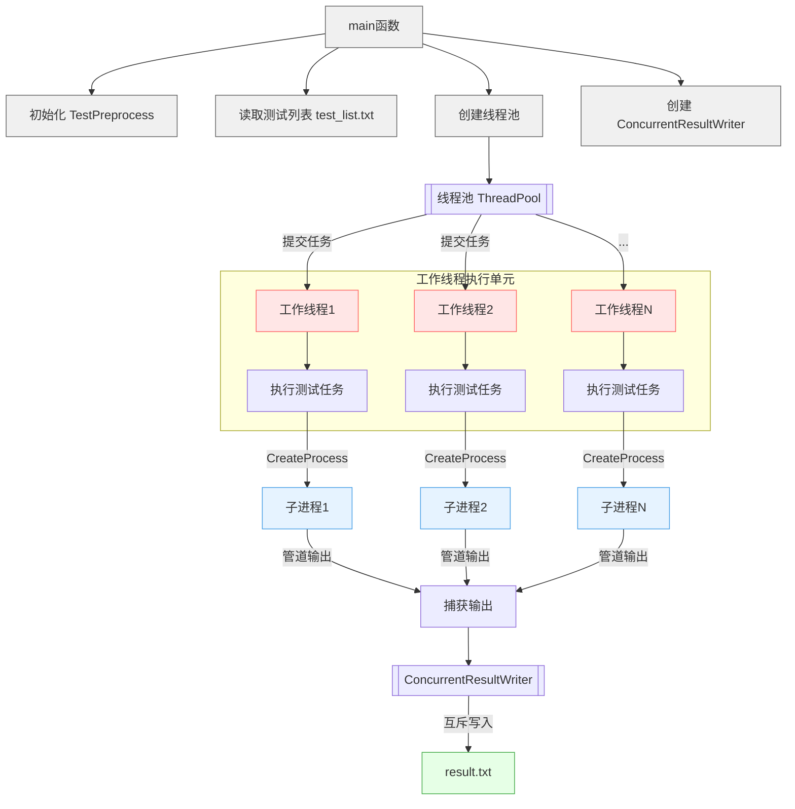

# 原生耗时

- **耦合版本：**142.469s 

- **独立版本：**1888.452s

# Python版本测试脚本耗时

- 耦合版本：579.437s
- 独立版本：707.479s

# C++版本耗时 V1

- 耦合版本：570.976s
- 独立版本：695.776s

# V1问题

1. 颗粒度过细，当一个测例本身执行时间很短（几毫秒）时，还为其创建一个子进程开销过大。

   进程初始化、加载dll、环境配置等重复操作积累成显著时间开销。

   C++创建子进程的时间开销一般在20ms左右，大型的进程fork开销可能达到100ms。

2. I/O管道效率低下，每个子进程需通过管道捕获输出，频繁的PeekNamedPipe轮询和FeadFile引入延迟。

   管道读写涉及内核态与用户态的切换，高频小数据量操作效率低。

3. 结果写入锁竞争

   ConcurrentResultWriter使用互斥锁保护写入文件，高并发时频繁争抢锁，导致阻塞。

4. 超时检查开销

   主循环中每100ms检查一次超时和管道数据，导致无意义的CPU占用和延迟

# V2耗时

- 耦合版本：36s
- 独立版本：

